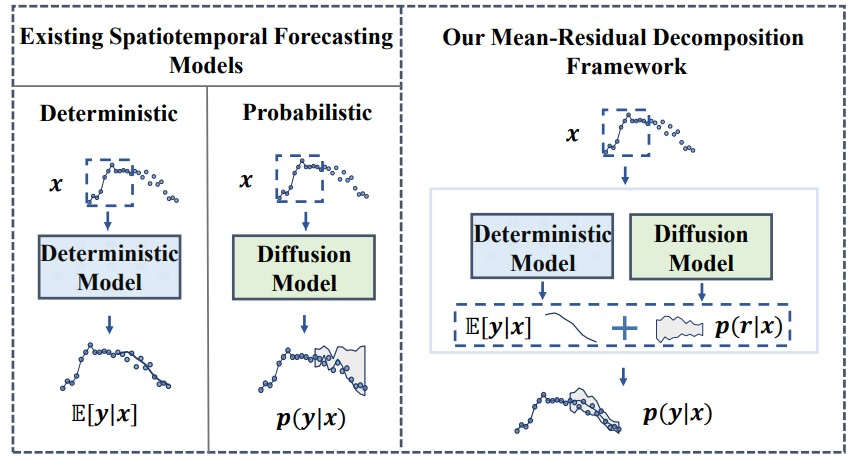
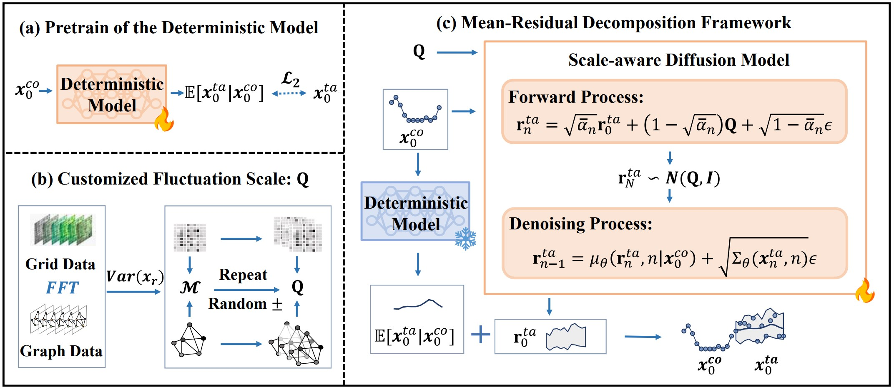

<div align="center">
  
# Collaborative Deterministic-Probabilistic Learning for Real-World Spatiotemporal Dynamics

[](https://github.com/pre-commit/pre-commit)
[](https://pytorch.org/get-started/locally/)
[](https://github.com/gitbooo/TSF_context_Eumetsat/blob/neurips_2023/README.md#license)
 
</div>

# Description
This is the official implementation of our KDD 2026 AI for Sciences Track submission: **Collaborative Deterministic-Probabilistic Learning for Real-World Spatiotemporal Dynamics**.

-----


## Introduction
In this paper, we propose **CoST**, a physics-inspired spatiotemporal forecasting framework that combines deterministic mean modeling with scale-aware diffusion to deliver accurate, well-calibrated uncertainty estimates at over 10× lower computational cost for real-world scientific systems.



## Overall Architecture
CoST consists of two stages. In the first stage, the deterministic model is pretrained to predict the conditional mean that captures the regular spatiotemporal patterns. In the second stage, guided by a customized fluctuation scale, we employ a scale-aware diffusion model to learn the residual distribution, enabling fine-grained uncertainty modeling. An overview of the CoST architecture is shown below. 




## Data
We use ten real-world datasets across four domains: climate, energy, communication systems, and urban systems. You can find the raw datasets in the `./data/dataset/` directory.

## ⚙️ Installation
### Environment
- Tested OS: Linux
- Python >= 3.9
- torch == 2.5.1

### Dependencies:
1. Install Pytorch with the correct CUDA version.
2. Use the `pip install -r requirements.txt` command to install all of the Python modules and packages used in this project.


## Model Training

We provide the scripts under the folder `./scripts/`. You can train CoST with the SST dataset as the following examples:

```bash 
# First, pretrain the deterministic model
python main_pretrain.py --data_name SST --device "cuda:4" --batch_size 8 --history_len 12 --predict_len 12  
# Then, train the diffusion model
python main_train.py --data_name SST --device "cuda:4" --batch_size 8 --history_len 12 --predict_len 12
```
Once your model is trained, you will find the trained model in the `./save/` directory. 

There are some new parameters to specify:

- `history_len` specifies the input sequence length.
- `predict_len` specifies the prediction horizon.

The repo currently includes code implementations for the following task:

> **12-12 Prediction**: We provide the scripts for the reproduction of 12-12 prediction results in this repo.
